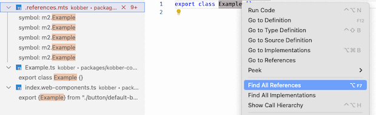

# Integration Checker

Find and analyze Kobber imports across consumer repositories. Generates:
- `.references.mts` for quick symbol lookups in editors
- CSV summaries in [dest](./dest)

## Setup
1) Copy `.env.template` → `.env` and fill missing values
2) Run `yarn`

## Configure repos
Define repositories in [repos.json](./repos.json). Repos can be local or external; external repos will be cloned to the OS temp directory.

## Scripts
- `yarn build`: build CLI files to [bin](./bin)
- `yarn dev`: build CLI files to [bin](./bin) (watched)
- `yarn clone-repos`: clone repos from [repos.json](./repos.json)
- `yarn create-csv`: write Kobber import references to [dest](./dest)

## Use from another monorepo package
1) `yarn add -D @internal/integration-checker`
2) Create a `sourceMap.ts` that maps import specifiers to source files (for jumping to definitions):
```ts
// sourceMap.ts
export const sourceMap = { "@org/components/react": "./src/react.js" };
```
3) Add a script:
```json
{
  "scripts": {
    "create-ts-refs": "create-ts-refs --sourceMap=sourceMap.ts --out=.references.mts"
  }
}
```
4) Run `yarn create-ts-refs` to generate `.references.mts` in the package root, then open it to find references across consumer repos.



## One-liner (from monorepo root)
```bash
yarn clone-repos && yarn create-ts-refs && yarn create-csv
```
